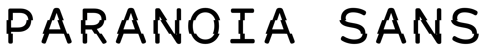
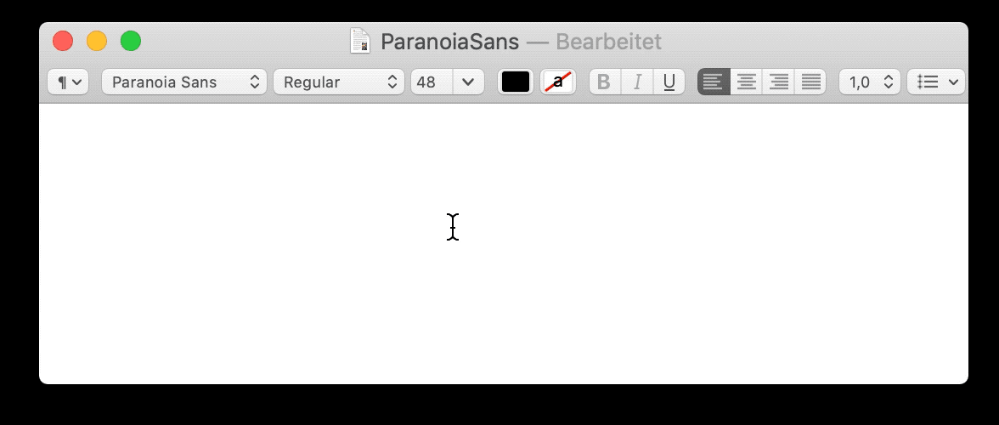

# PARANOIA SANS
V. 1.2

A self-censoring font by [Florian Egermann](https://www.fleg.de), 2020

Based on [Courier Prime Sans](https://quoteunquoteapps.com/courierprime/#code-sans) by [Quote-Unquote Apps](https://quoteunquoteapps.com/index.php).

[https://www.fleg.de/paranoia-sans](https://www.fleg.de/paranoia-sans)

## About

PARANOIA SANS is a self-censoring, conspiratorial typeface that will automatically redact terms that are popular in conspiracy myths. 

It IS a conspiracy. They ARE after you. And now, you have a typeface to prove it.

## How it works

PARANOIA SANS uses *ligatures* (an open type font feature that replaces a combination of strings with other characters) to replace a list of conspiratorial terms with a graphic resembling a redacted word. E.g. the ligature "5G" is replaced by a two-character wide black box. 

